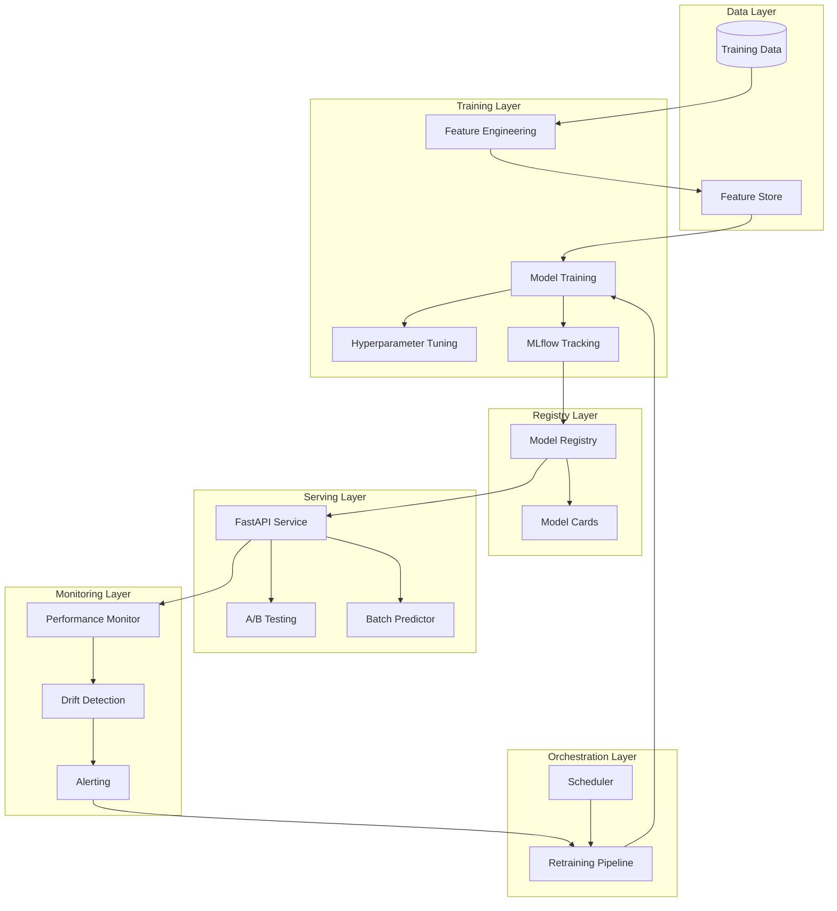

# Design Document: Production ML Platform with MLOps

## Overview

The Production ML Platform with MLOps is a comprehensive system for managing the complete machine learning lifecycle. The platform integrates feature engineering, experiment tracking, model registry, prediction serving, monitoring, and automated retraining into a cohesive workflow. The architecture emphasizes modularity, scalability, and observability to support production-grade ML operations.

The system is built around several key components:
- **Feature Store**: Centralized feature management with versioning
- **Experiment Tracking**: MLflow-based experiment and artifact management
- **Model Registry**: Versioned model storage with lifecycle management
- **Prediction Service**: FastAPI-based REST API for real-time and batch predictions
- **A/B Testing Framework**: Traffic routing and variant comparison
- **Monitoring System**: Drift detection and performance tracking
- **Retraining Pipeline**: Automated model retraining orchestration

## Architecture

The platform follows a microservices architecture with clear separation of concerns:



### Component Interactions

1. **Training Flow**: Data → Feature Engineering → Feature Store → Model Training → MLflow → Model Registry
2. **Serving Flow**: Client Request → FastAPI → A/B Testing → Model → Prediction → Logging
3. **Monitoring Flow**: Predictions → Performance Monitor → Drift Detection → Alerts
4. **Retraining Flow**: Alert/Schedule → Retraining Pipeline → Training → Evaluation → Registry

## Components and Interfaces

### Feature Store

**Purpose**: Centralized repository for feature definitions, storage, and versioning.

**Interface**:
```python
class FeatureStore:
    def create_feature(
        self, 
        name: str, 
        definition: FeatureDefinition,
        metadata: Dict[str, Any]
    ) -> Feature:
        """Create a new feature with version 1."""
        
    def get_feature(
        self, 
        name: str, 
        version: Optional[int] = None
    ) -> Feature:
        """Get feature by name. Returns latest if version not specified."""
        
    def update_feature(
        self, 
        name: str, 
        definition: FeatureDefinition,
        metadata: Dict[str, Any]
    ) -> Feature:
        """Create new version of existing feature."""
        
    def list_features(
        self, 
        filters: Optional[Dict[str, Any]] = None
    ) -> List[Feature]:
        """List all features matching filters."""
```

**Implementation Notes**:
- Uses Databricks Feature Store or Feast as backing implementation
- Features are immutable once created; updates create new versions
- Metadata includes: author, timestamp, description, data types

### Experiment Tracking

**Purpose**: Track experiments, parameters, metrics, and artifacts using MLflow.

**Interface**:
```python
class ExperimentTracker:
    def start_run(
        self, 
        experiment_name: str,
        run_name: Optional[str] = None
    ) -> Run:
        """Start a new experiment run."""
        
    def log_params(self, params: Dict[str, Any]) -> None:
        """Log hyperparameters for current run."""
        
    def log_metrics(self, metrics: Dict[str, float]) -> None:
        """Log evaluation metrics for current run."""
        
    def log_artifact(self, artifact_path: str) -> None:
        """Log artifact (model, plot, etc.) for current run."""
        
    def end_run(self) -> None:
        """End current run."""
        
    def search_runs(
        self, 
        experiment_name: str,
        filter_string: Optional[str] = None,
        order_by: Optional[List[str]] = None
    ) -> List[Run]:
        """Search and filter experiment runs."""
```

### Model Registry

**Purpose**: Centralized model storage with versioning and lifecycle management.

**Interface**:
```python
class ModelRegistry:
    def register_model(
        self,
        name: str,
        model_uri: str,
        model_card: ModelCard,
        lineage: ModelLineage
    ) -> RegisteredModel:
        """Register a new model version."""
        
    def transition_stage(
        self,
        name: str,
        version: int,
        stage: ModelStage  # STAGING, PRODUCTION, ARCHIVED
    ) -> RegisteredModel:
        """Transition model to new stage."""
        
    def get_model(
        self,
        name: str,
        version: Optional[int] = None,
        stage: Optional[ModelStage] = None
    ) -> RegisteredModel:
        """Get model by name/version or stage."""
        
    def get_model_card(
        self,
        name: str,
        version: int
    ) -> ModelCard:
        """Get model card for specific version."""
```

**Data Structures**:
```python
@dataclass
class ModelLineage:
    training_data_version: str
    feature_versions: Dict[str, int]
    training_run_id: str
    parent_model_version: Optional[int]

@dataclass
class ModelCard:
    description: str
    intended_use: str
    training_data_info: str
    performance_metrics: Dict[str, float]
    limitations: str
    ethical_considerations: str
    approved: bool = False
```

### Prediction Service

**Purpose**: FastAPI-based REST API for serving predictions.

**Interface**:
```python
@app.post("/predict")
async def predict(request: PredictionRequest) -> PredictionResponse:
    """Single prediction endpoint."""
    
@app.post("/predict/batch")
async def predict_batch(request: BatchPredictionRequest) -> BatchPredictionResponse:
    """Batch prediction endpoint."""
    
@app.post("/predict/ab")
async def predict_ab(request: PredictionRequest) -> PredictionResponse:
    """A/B testing prediction endpoint."""
    
@app.get("/health")
async def health() -> HealthResponse:
    """Health check endpoint."""
```

**Data Structures**:
```python
@dataclass
class PredictionRequest:
    features: Dict[str, Any]
    model_name: Optional[str] = None
    
@dataclass
class PredictionResponse:
    prediction: Any
    model_version: int
    model_name: str
    timestamp: datetime
    variant: Optional[str] = None  # For A/B testing
```

### A/B Testing Framework

**Purpose**: Route traffic between model variants and track performance.

**Interface**:
```python
class ABTestingFramework:
    def create_test(
        self,
        name: str,
        champion_model: str,
        challenger_model: str,
        traffic_split: float  # 0.0 to 1.0
    ) -> ABTest:
        """Create new A/B test."""
        
    def route_request(
        self,
        test_name: str,
        request_id: str
    ) -> ModelVariant:
        """Determine which variant to use for request."""
        
    def log_prediction(
        self,
        test_name: str,
        variant: ModelVariant,
        request: PredictionRequest,
        response: PredictionResponse
    ) -> None:
        """Log prediction for A/B test tracking."""
        
    def get_metrics(
        self,
        test_name: str
    ) -> ABTestMetrics:
        """Get metrics for each variant."""
        
    def update_traffic_split(
        self,
        test_name: str,
        new_split: float
    ) -> None:
        """Update traffic split ratio."""
```

### Monitoring System

**Purpose**: Detect data drift and track model performance.

**Interface**:
```python
class MonitoringSystem:
    def check_drift(
        self,
        reference_data: pd.DataFrame,
        current_data: pd.DataFrame,
        threshold: float = 0.05
    ) -> DriftReport:
        """Check for data drift."""
        
    def track_performance(
        self,
        predictions: List[Prediction],
        actuals: Optional[List[Any]] = None
    ) -> PerformanceMetrics:
        """Track model performance over time."""
        
    def generate_alert(
        self,
        alert_type: AlertType,
        details: Dict[str, Any]
    ) -> Alert:
        """Generate monitoring alert."""
        
    def send_notification(
        self,
        alert: Alert,
        channels: List[str]
    ) -> None:
        """Send alert notification."""
```

### Retraining Pipeline

**Purpose**: Orchestrate automated model retraining.

**Interface**:
```python
class RetrainingPipeline:
    def trigger_retraining(
        self,
        model_name: str,
        trigger_type: TriggerType,  # DRIFT, SCHEDULE, MANUAL
        trigger_details: Dict[str, Any]
    ) -> RetrainingJob:
        """Trigger model retraining."""
        
    def evaluate_model(
        self,
        new_model: Model,
        current_model: Model,
        test_data: pd.DataFrame
    ) -> EvaluationResult:
        """Evaluate new model against current."""
        
    def deploy_model(
        self,
        model: Model,
        stage: ModelStage
    ) -> None:
        """Deploy model to specified stage."""
```

## Data Models

### Feature

```python
@dataclass
class Feature:
    id: str
    name: str
    version: int
    definition: FeatureDefinition
    data_type: str
    metadata: Dict[str, Any]
    created_at: datetime
    created_by: str
```

### Model

```python
@dataclass
class RegisteredModel:
    name: str
    version: int
    stage: ModelStage
    model_uri: str
    lineage: ModelLineage
    model_card: ModelCard
    created_at: datetime
    updated_at: datetime
```

### Prediction

```python
@dataclass
class Prediction:
    id: str
    model_name: str
    model_version: int
    features: Dict[str, Any]
    prediction: Any
    timestamp: datetime
    latency_ms: float
    variant: Optional[str] = None
```

### DriftReport

```python
@dataclass
class DriftReport:
    timestamp: datetime
    dataset_drift_detected: bool
    drifted_features: List[str]
    drift_scores: Dict[str, float]
    threshold: float
```

## Correctness Properties

*A property is a characteristic or behavior that should hold true across all valid executions of a system—essentially, a formal statement about what the system should do. Properties serve as the bridge between human-readable specifications and machine-verifiable correctness guarantees.*

### Property 1: Feature creation assigns unique identifiers and version 1
*For any* feature definition, when creating a new feature, the Feature Store should assign a unique identifier and set the version to 1.
**Validates: Requirements 1.1**

### Property 2: Feature queries return latest version by default
*For any* feature with multiple versions, when querying by name without specifying a version, the Feature Store should return the version with the highest version number.
**Validates: Requirements 1.2**

### Property 3: Feature updates preserve version history
*For any* existing feature, when updating the feature, the Feature Store should create a new version while keeping all previous versions accessible.
**Validates: Requirements 1.3**

### Property 4: Feature version retrieval is exact (round-trip)
*For any* feature and version number, storing a feature and then retrieving that specific version should return data identical to what was stored.
**Validates: Requirements 1.4**

### Property 5: Feature metadata completeness
*For any* feature with multiple versions, each version should have complete metadata including creation timestamp, author, and description.
**Validates: Requirements 1.5**

### Property 6: Experiment runs have unique identifiers
*For any* training run, when starting the run, the MLOps Platform should assign a unique experiment identifier.
**Validates: Requirements 2.1**

### Property 7: Experiment parameter logging completeness
*For any* set of hyperparameters logged during a run, querying the experiment details should return all logged parameters.
**Validates: Requirements 2.1, 2.4**

### Property 8: Experiment metric logging completeness
*For any* set of metrics logged during a run, querying the experiment details should return all logged metrics.
**Validates: Requirements 2.2, 2.4**

### Property 9: Experiment query sorting correctness
*For any* set of experiments and a sort metric, querying experiments sorted by that metric should return results in the correct order (ascending or descending).
**Validates: Requirements 2.3**

### Property 10: Experiment comparison includes all data
*For any* set of experiments being compared, the comparison output should include all parameters and metrics from each experiment.
**Validates: Requirements 2.5**

### Property 11: Model registration assigns unique versions
*For any* model being registered, the Model Registry should assign a unique version number that increments from previous versions of the same model.
**Validates: Requirements 3.1**

### Property 12: Stage transitions preserve version numbers
*For any* model, when transitioning between stages (staging, production, archived), the version number should remain unchanged.
**Validates: Requirements 3.2**

### Property 13: Production model queries filter correctly
*For any* set of models in various stages, querying for production models should return only models where stage equals PRODUCTION.
**Validates: Requirements 3.3**

### Property 14: Model lineage completeness
*For any* registered model, the stored lineage should include training data version, feature versions, and training run ID.
**Validates: Requirements 3.4**

### Property 15: Model query by version or stage
*For any* model with multiple versions, querying by either version number or stage name should return the correct model.
**Validates: Requirements 3.5**

### Property 16: Invalid prediction requests return errors
*For any* prediction request with invalid features (wrong types, missing required fields, out-of-range values), the Prediction Service should return an error response with validation details.
**Validates: Requirements 4.3**

### Property 17: Prediction logging completeness
*For any* prediction made, the logged data should include request features, prediction result, and model version.
**Validates: Requirements 4.4**

### Property 18: A/B test traffic distribution
*For any* A/B test with a configured split ratio, over a large number of requests, the proportion of requests routed to each variant should approximate the configured ratio (within statistical bounds).
**Validates: Requirements 5.1**

### Property 19: A/B test variant logging
*For any* prediction request during A/B testing, the logged data should include which model variant served the request.
**Validates: Requirements 5.2**

### Property 20: A/B test metrics separation
*For any* A/B test, querying metrics should return separate performance metrics for champion and challenger variants.
**Validates: Requirements 5.3**

### Property 21: A/B test split ratio updates apply immediately
*For any* A/B test, when updating the traffic split ratio, subsequent requests should use the new ratio.
**Validates: Requirements 5.4**

### Property 22: A/B test recommendations for significant results
*For any* A/B test where the challenger achieves statistically significant better performance, the framework should provide a recommendation to promote the challenger.
**Validates: Requirements 5.5**

### Property 23: Drift detection generates alerts with details
*For any* dataset where feature drift exceeds configured thresholds, the MLOps Platform should generate an alert containing which specific features drifted and their drift scores.
**Validates: Requirements 6.2**

### Property 24: Performance metric tracking
*For any* set of predictions, the MLOps Platform should track and store performance metrics over time.
**Validates: Requirements 6.3**

### Property 25: Performance degradation alerts
*For any* scenario where model performance falls below configured thresholds, the MLOps Platform should generate a performance alert.
**Validates: Requirements 6.4**

### Property 26: Alert notifications are sent
*For any* drift or performance alert generated, the MLOps Platform should send notifications to all configured channels.
**Validates: Requirements 6.5**

### Property 27: Drift alerts trigger retraining
*For any* drift alert, the Retraining Pipeline should initiate a retraining workflow.
**Validates: Requirements 7.1**

### Property 28: Retraining includes evaluation
*For any* model retraining, the Retraining Pipeline should evaluate the new model against the current production model.
**Validates: Requirements 7.3**

### Property 29: Better models are promoted to staging
*For any* retrained model that performs better than the current production model, the Retraining Pipeline should register it in the staging stage.
**Validates: Requirements 7.4**

### Property 30: Worse models are not deployed
*For any* retrained model that performs worse than the current production model, the Retraining Pipeline should abort deployment and log the results.
**Validates: Requirements 7.5**

### Property 31: Hyperparameter trial logging
*For any* hyperparameter optimization trial, when the trial completes, the MLOps Platform should log both the parameters and evaluation metrics.
**Validates: Requirements 8.2**

### Property 32: Optimization returns best configuration
*For any* completed hyperparameter optimization, the MLOps Platform should return the parameter configuration with the best evaluation metric.
**Validates: Requirements 8.3**

### Property 33: Batch predictions process all records
*For any* batch prediction job with a dataset, the Prediction Service should return predictions for every record in the dataset.
**Validates: Requirements 9.1**

### Property 34: Batch job progress updates
*For any* running batch prediction job, the Prediction Service should provide progress updates indicating completion percentage.
**Validates: Requirements 9.3**

### Property 35: Batch results storage
*For any* completed batch prediction job, the Prediction Service should store results in the specified output location.
**Validates: Requirements 9.4**

### Property 36: Batch job failure recovery
*For any* failed batch prediction job, the Prediction Service should provide error details and support resuming from the last successful checkpoint.
**Validates: Requirements 9.5**

### Property 37: Model registration requires model card
*For any* model registration attempt, the Model Registry should reject registration if the model card is missing required fields (description, intended use, training data information).
**Validates: Requirements 10.1**

### Property 38: Model card completeness
*For any* model card created, it should include performance metrics, limitations, and ethical considerations.
**Validates: Requirements 10.2**

### Property 39: Model queries return model cards
*For any* model query, the Model Registry should return the associated model card along with the model.
**Validates: Requirements 10.3**

### Property 40: Model card versioning consistency
*For any* model update, the Model Registry should version the model card with the same version number as the model.
**Validates: Requirements 10.4**

### Property 41: Production models require approved model cards
*For any* model in production stage, the Model Registry should ensure the model card is complete and marked as approved.
**Validates: Requirements 10.5**

## Error Handling

### Feature Store Errors
- **FeatureNotFoundException**: Raised when querying for non-existent feature
- **FeatureVersionNotFoundException**: Raised when requesting invalid version
- **DuplicateFeatureException**: Raised when creating feature with existing name (should update instead)
- **InvalidFeatureDefinitionException**: Raised when feature definition is malformed

### Model Registry Errors
- **ModelNotFoundException**: Raised when querying for non-existent model
- **InvalidStageTransitionException**: Raised when attempting invalid stage transition
- **IncompleteModelCardException**: Raised when model card missing required fields
- **ModelCardNotApprovedException**: Raised when attempting to promote model with unapproved card

### Prediction Service Errors
- **InvalidFeatureException**: Raised when prediction request contains invalid features
- **ModelLoadException**: Raised when model cannot be loaded from registry
- **PredictionTimeoutException**: Raised when prediction exceeds timeout threshold
- **BatchJobException**: Raised when batch job encounters errors

### Monitoring Errors
- **DriftDetectionException**: Raised when drift detection fails
- **AlertDeliveryException**: Raised when alert notification fails
- **InsufficientDataException**: Raised when not enough data for drift detection

### Retraining Errors
- **RetrainingFailedException**: Raised when retraining workflow fails
- **EvaluationException**: Raised when model evaluation fails
- **DeploymentException**: Raised when model deployment fails

## Testing Strategy

The testing strategy employs both unit testing and property-based testing to ensure comprehensive coverage.

### Unit Testing

Unit tests verify specific examples, integration points, and edge cases:

**Feature Store**:
- Test creating feature with minimal metadata
- Test querying non-existent feature raises exception
- Test updating non-existent feature raises exception
- Test feature with empty name is rejected

**Model Registry**:
- Test registering first version of model
- Test transitioning from staging to production
- Test querying production models when none exist
- Test model card validation rejects incomplete cards

**Prediction Service**:
- Test prediction with sample valid features
- Test prediction with missing required feature
- Test health check endpoint returns 200
- Test batch prediction with empty dataset

**A/B Testing**:
- Test creating A/B test with 50/50 split
- Test updating split ratio from 50/50 to 90/10
- Test A/B test with only champion model (100/0 split)

**Monitoring**:
- Test drift detection with identical distributions (no drift)
- Test drift detection with completely different distributions (drift)
- Test alert generation with specific drift scenario
- Test notification delivery to multiple channels

**Retraining**:
- Test manual retraining trigger
- Test retraining with better model promotes to staging
- Test retraining with worse model aborts deployment

### Property-Based Testing

Property-based tests verify universal properties across all inputs using **Hypothesis** (Python) as the testing framework.

**Configuration**:
- Each property-based test should run a minimum of 100 iterations
- Tests should use appropriate strategies for generating test data
- Each test must be tagged with a comment referencing the correctness property

**Tag Format**:
```python
# Feature: mlops-platform, Property 1: Feature creation assigns unique identifiers and version 1
def test_feature_creation_unique_ids(feature_definition):
    ...
```

**Test Categories**:

1. **Feature Store Properties** (Properties 1-5):
   - Generate random feature definitions
   - Test versioning behavior across multiple updates
   - Verify metadata completeness

2. **Experiment Tracking Properties** (Properties 6-10):
   - Generate random hyperparameters and metrics
   - Test logging and retrieval completeness
   - Verify sorting and comparison logic

3. **Model Registry Properties** (Properties 11-15):
   - Generate random models and lineage data
   - Test versioning and stage transitions
   - Verify query filtering

4. **Prediction Service Properties** (Properties 16-17):
   - Generate valid and invalid feature sets
   - Test error handling and logging

5. **A/B Testing Properties** (Properties 18-22):
   - Generate large numbers of requests
   - Test traffic distribution and metric separation
   - Verify configuration updates

6. **Monitoring Properties** (Properties 23-26):
   - Generate datasets with varying drift levels
   - Test alert generation and notification

7. **Retraining Properties** (Properties 27-30):
   - Generate scenarios with better/worse models
   - Test conditional deployment logic

8. **Hyperparameter Tuning Properties** (Properties 31-32):
   - Generate random parameter spaces
   - Test logging and best configuration selection

9. **Batch Prediction Properties** (Properties 33-36):
   - Generate datasets of varying sizes
   - Test completeness and error recovery

10. **Model Card Properties** (Properties 37-41):
    - Generate complete and incomplete model cards
    - Test validation and versioning

**Example Property Test**:
```python
from hypothesis import given, strategies as st

# Feature: mlops-platform, Property 4: Feature version retrieval is exact (round-trip)
@given(
    feature_name=st.text(min_size=1, max_size=50),
    feature_data=st.dictionaries(
        keys=st.text(min_size=1),
        values=st.one_of(st.integers(), st.floats(), st.text())
    )
)
def test_feature_round_trip(feature_store, feature_name, feature_data):
    # Create feature
    feature = feature_store.create_feature(
        name=feature_name,
        definition=feature_data,
        metadata={"author": "test"}
    )
    
    # Retrieve feature
    retrieved = feature_store.get_feature(
        name=feature_name,
        version=feature.version
    )
    
    # Verify round-trip
    assert retrieved.definition == feature_data
    assert retrieved.version == feature.version
```

### Integration Testing

Integration tests verify end-to-end workflows:
- Complete training pipeline: data → features → training → registry
- Complete serving pipeline: request → model load → prediction → logging
- Complete monitoring pipeline: predictions → drift detection → alert → retraining
- A/B testing workflow: test creation → traffic routing → metrics → promotion

### Performance Testing

Performance tests verify non-functional requirements:
- Prediction latency under load (target: p95 < 100ms)
- Throughput testing (target: 1000+ req/s)
- Batch prediction scalability (target: 1M records)
- Concurrent experiment tracking

### Test Infrastructure

**Fixtures**:
- In-memory feature store for fast testing
- Mock MLflow tracking server
- Test model registry with temporary storage
- Mock monitoring system

**Test Data**:
- Synthetic datasets for training and prediction
- Pre-trained test models
- Reference distributions for drift detection

**CI/CD Integration**:
- Run unit tests on every commit
- Run property tests on pull requests
- Run integration tests before deployment
- Run performance tests weekly

## Deployment Architecture

### Development Environment
- Local Databricks workspace
- Local MLflow tracking server
- FastAPI development server
- SQLite for feature store

### Staging Environment
- Databricks staging workspace
- Shared MLflow tracking server
- FastAPI on ECS with 2 instances
- PostgreSQL for feature store
- Evidently AI monitoring

### Production Environment
- Databricks production workspace
- Production MLflow tracking server
- FastAPI on ECS with auto-scaling (2-10 instances)
- PostgreSQL with replication for feature store
- Evidently AI monitoring with alerting
- Airflow for orchestration

### Infrastructure as Code
- Terraform for AWS resources
- Docker for containerization
- Kubernetes/ECS for orchestration
- GitHub Actions for CI/CD

## Security Considerations

- **Authentication**: API key-based authentication for prediction service
- **Authorization**: Role-based access control for model registry
- **Data Privacy**: Feature anonymization for sensitive data
- **Model Security**: Model artifact encryption at rest
- **Audit Logging**: Complete audit trail for model deployments
- **Network Security**: VPC isolation for production services

## Monitoring and Observability

### Application Metrics
- Prediction latency (p50, p95, p99)
- Throughput (requests per second)
- Error rates by error type
- Model loading time

### ML Metrics
- Prediction distribution over time
- Feature drift scores
- Model performance metrics
- A/B test conversion rates

### Infrastructure Metrics
- CPU and memory utilization
- API response times
- Database query performance
- Queue depths for batch jobs

### Dashboards
- Real-time prediction monitoring
- Model performance trends
- Drift detection alerts
- A/B test results
- System health overview

## Future Enhancements

- **Multi-model serving**: Support for ensemble models
- **Feature engineering automation**: AutoML for feature generation
- **Explainability**: SHAP values for prediction explanations
- **Model compression**: Quantization and pruning for faster inference
- **Edge deployment**: Model deployment to edge devices
- **Federated learning**: Privacy-preserving distributed training
